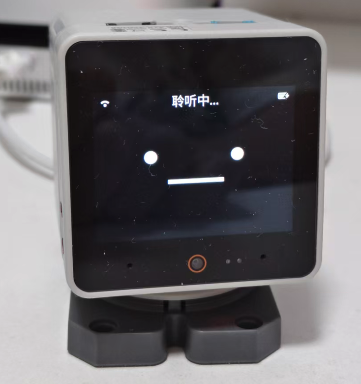

# StackChan：会回应摸摸头的小机器人

为 **M5Stack StackChan K151 / CoreS3** 开发的机器人固件：黑底萌脸、讲话动嘴、语音控制头部、待机张望、摸头回应，以及跳舞时的 RGB 灯效。

当前源码版本：**0.1.0-alpha.1（实验预发布）**。首次使用需要本机校准；本次仓库修订未烧录机器人。

我们希望它聊天时有一点小动作，闲下来会看看周围，被摸头时会抬起脸回应，听到“跳舞”时能摇头晃脑。这些表情与运动交互，是本仓库重点开发的内容。

  
   
  StackChan K151 实机展示

## 我们实现了什么

### 黑底萌脸，讲话时动嘴

参考 StackChan 原厂的几何风格重新绘制眼睛和嘴巴，背景保持黑色。包含 **21 种情绪、41 个 GIF 状态**：

- 普通待机嘴巴不动；讲话时切换到当前情绪的动嘴版本，讲话结束恢复闭嘴。
- 开心、喜欢、思考、难过等表情都能在讲话时动嘴，不必先变回普通表情。
- 困困始终闭嘴。
- 隐藏对话字幕，让脸成为屏幕的主要内容，保留其他状态界面。

动嘴跟随实际语音播放状态，不是逐字或音素级对口型。这些 GIF 是重新绘制的原厂风格素材。

### 摸摸头，会抬头和轻点头

轻触头顶后显示喜欢的表情，柔和抬头，再轻轻上下点头。持续抚摸会延续回应，**松手约 3 秒后恢复触碰前的姿态**；新的头部指令可以取消恢复。

### 待机时自己四处看看

没有对话时，每约 **4～8 秒**随机向左右或上下张望。进入对话即停止待机张望，明确指令会优先执行。“停止动作”可以暂停自动动作。

### 让 AI 控制头部

支持回正、抬头、低头、左右看、点头、摇头，以及小幅位置调整、停止与恢复。完整说法和效果见下方[交互指令列表](#交互指令列表)。

讲话期间还会穿插少量轻微转头或点头，每轮最多两次，避免一直晃动。明确动作指令优先于自动微动作。模型是否正确调用工具仍需要连上对话服务后实测；指令入队不代表已经到位。

### 跳舞时摇头晃脑，RGB 切换颜色

说“跳个舞”，触发约 **15 秒**的随机左右、上下摆头，底座 **12 颗 RGB 灯**不断切换颜色。结束后恢复跳舞前姿态并关灯；摸头、新的头部动作指令或故障可以中断跳舞。

目前使用预设动作时序，还没有音乐播放或节拍同步。

### 运动保护与故障诊断

动作由同一个舵机工作任务执行，统一处理反馈、限位、停止和动作抢占。加入了停滞、过载保护，以及通信恢复和 UART/舵机统计。

通信超时、过载与机械停滞分别报告，避免把所有通信问题都说成“头部卡住”。

## 交互指令列表

以下按当前代码整理。引号内是口语示例，不是必须逐字匹配的固定关键词；需要 AI 正确调用设备工具，并以实际反馈判断是否执行成功。

### 头部动作与跳舞

| 可以这样说 | 对应交互 |
| --- | --- |
| “跳舞”“跳个舞”“扭一扭” | 开始约 15 秒随机左右、上下摆头，同时 RGB 灯切换颜色 |
| “停止跳舞”“别跳了” | 结束跳舞，恢复跳舞前姿态并关灯 |
| “回正”“看前面” | 回到校准后的正面姿态 |
| “抬头”“向上看” | 移到抬头预设位置 |
| “低头”“向下看” | 移到低头预设位置 |
| “向左看”“向左转头” | 向机器人自己的左侧转头 |
| “向右看”“向右转头” | 向机器人自己的右侧转头 |
| “再抬一点” | 相对当前基准姿态小幅抬头 |
| “再低一点” | 相对当前基准姿态小幅低头 |
| “再往左一点” | 相对当前基准姿态小幅左转 |
| “再往右一点” | 相对当前基准姿态小幅右转 |
| “点头”“点点头” | 两次点头，再回到基准姿态 |
| “摇头”“摇摇头” | 两次左右往返，再回到基准姿态 |
| “别动”“停止动作” | 停止运动并保持当前姿态，暂停待机张望和讲话微动作；正在跳舞时也会中断 |
| “恢复动作”“继续自动动作” | 满足验收和反馈条件时恢复自动动作；不是继续上一次舞蹈 |
| “头现在朝哪里？”“头部状态怎么样？” | 查询实际角度、目标姿态、是否跳舞和故障状态，不驱动头部 |

左右以机器人自身视角为准，正对它时与你的左右相反。相对调整由设备限制在安全范围内；边界处动作可能缩小或被拒绝。故障锁定时，应先检查连接、供电和活动空间，反馈有效后单次尝试恢复并查询状态，不能反复要求它强行动作。

### 设备基础控制

这些是当前固件保留的设备工具，部分取决于硬件初始化和服务支持，不能仅凭代码注册认为已完成实机验收。

| 可以这样说 | 对应交互与条件 |
| --- | --- |
| “音量调到 30%” | 设置扬声器音量，范围 0～100 |
| “声音大一点”“声音小一点” | 查询当前音量后调整；具体调整量由 AI 选择 |
| “屏幕亮度调到 50%”“屏幕暗一点” | 设置屏幕背光亮度，范围 0～100；不是 RGB 灯亮度 |
| “现在电量多少？”“现在音量多少？”“设备状态怎么样？” | 查询设备实际返回的电池、音量、屏幕、网络等状态 |
| “切换深色主题”“切换浅色主题” | 显示主题可用时切换系统界面主题；不代表重新绘制 GIF 或改变萌脸黑底 |
| “看看你面前是什么” | 摄像头初始化成功、对应工具可用且服务支持时拍照分析；需实机验证 |

### 触摸与自动交互

| 操作或场景 | 对应交互 |
| --- | --- |
| 轻触头顶并持续摸摸 | 喜欢表情、柔和抬头，再轻微上下点头；需自动动作已启用且反馈有效 |
| 松开头顶约 3 秒 | 恢复触碰前姿态；新的头部指令可以取消恢复 |
| 跳舞时摸头 | 中断跳舞与灯效，满足条件时进入摸头回应 |
| 正常运行时短触屏幕后松开（少于 500 ms） | 根据当前状态开始、结束或中断对话；不是头顶触摸 |
| 待机，没有明确指令 | 每约 4～8 秒自动张望，进入对话停止张望 |
| 机器人正在讲话 | 当前情绪的嘴巴动画与少量讲话微动作；困困不动嘴、没有讲话微动作 |

暂未提供独立的“RGB 开灯/关灯/指定颜色”语音工具，灯效随跳舞控制。呼噜声、播放音乐和跟随音乐节拍跳舞尚未实现，不属于可用指令。

## 适配和完成情况

本项目实测对象是 **StackChan K151、CoreS3 / ESP32-S3、16 MB Flash、8 MB Quad PSRAM、ILI9342C 显示配置**，使用原有底座、反馈舵机与头顶触摸传感器。其他显示屏修订版尚未验证。

**当前提供开发源码，尚无通用烧录包。** 每台设备单独保存零点并通过本地验收，缺失或损坏时头部保持禁用；原版本的验收标志不会自动沿用。见[校准指南](docs/stackchan-calibration.md)。表情包从本次标准构建的公开字体、唤醒模型和仓库绘图代码生成，见[开发指南](docs/stackchan-development.md)。

- 2026-10-01：完整断电后，一分钟静止采样、一次跳舞和自动待机复测没有出现通信错误或锁定故障。
- 2026-10-06：0.1.0-alpha.1 在 Mac M4 ARM64 上通过 10 组 C++ 主机回归、81 项构建脚本测试、9 项资源测试与 ESP-IDF 6.0.1 K151 编译；实际生成 41 GIF，资源包 5,240,144 字节，字体与模型保留。新校准流程未实机验收。
- 猫咪呼噜声尚未在实机实现。2026-10-06 已移除相关运行代码、录音与专用测试；摸头表情和动作保留。
- 舵机偶发串口错码的根因仍未确定；上述短期测试不能证明长期完全稳定。详细过程见[板卡说明与诊断记录](main/boards/m5stack/stackchan-k151/README.md)。

## 从哪里开始

- [开发指南](docs/stackchan-development.md)：获取源码、编译、生成表情资源、AI 工具参数和测试命令。
- [板卡说明](main/boards/m5stack/stackchan-k151/README.md)：校准、硬件接口、动作参数、保护和实机记录。
- [自动测试与依赖](docs/stackchan-ci.md)：固定 SDK、组件 lock、资源生成和构建工件。
- [实机验收清单](docs/stackchan-hardware-validation.md)：长时间待机、动作抢占、摸头与故障恢复。
- [版本记录](CHANGELOG.md)：项目自身版本与升级变化。
- [贡献与问题反馈](CONTRIBUTING.md)：如何报告问题、提交改动和更新文档。

独立板卡目录为 `m5stack/stackchan-k151`，变体为 `m5stack-stackchan-k151`。使用 ESP-IDF 6.0.1 或以上版本开发；当前默认分支为 `stackchan-head-control`。

## 来源与许可

语音对话基础来自 [XiaoZhi ESP32](https://github.com/78/xiaozhi-esp32) v2.5.0，头部驱动与弹簧动画参考 [M5Stack StackChan](https://github.com/m5stack/StackChan)。本项目是个人开发项目。

保留上游 [MIT 许可证](LICENSE)及[原厂依赖的来源与许可](main/boards/m5stack/stackchan-k151/factory_upstream/README.md)。字体、模型与构建工件的通知见[资源来源说明](docs/stackchan-assets-provenance.md)。呼噜音频尝试已从当前版本移除，素材来源和许可可在历史提交中追溯。

请勿提交整机备份、NVS、联网原始日志、密码或 Token。历史实验与交接文件保留在 `docs/stackchan-history/`，历史设计位于 `docs/superpowers/`，均已标记归档，仅用于追溯，当前行为以本首页和板卡说明为准。
